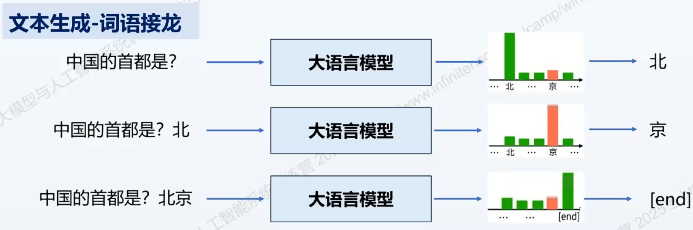
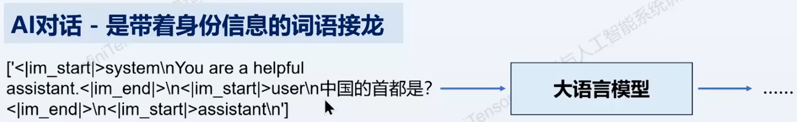
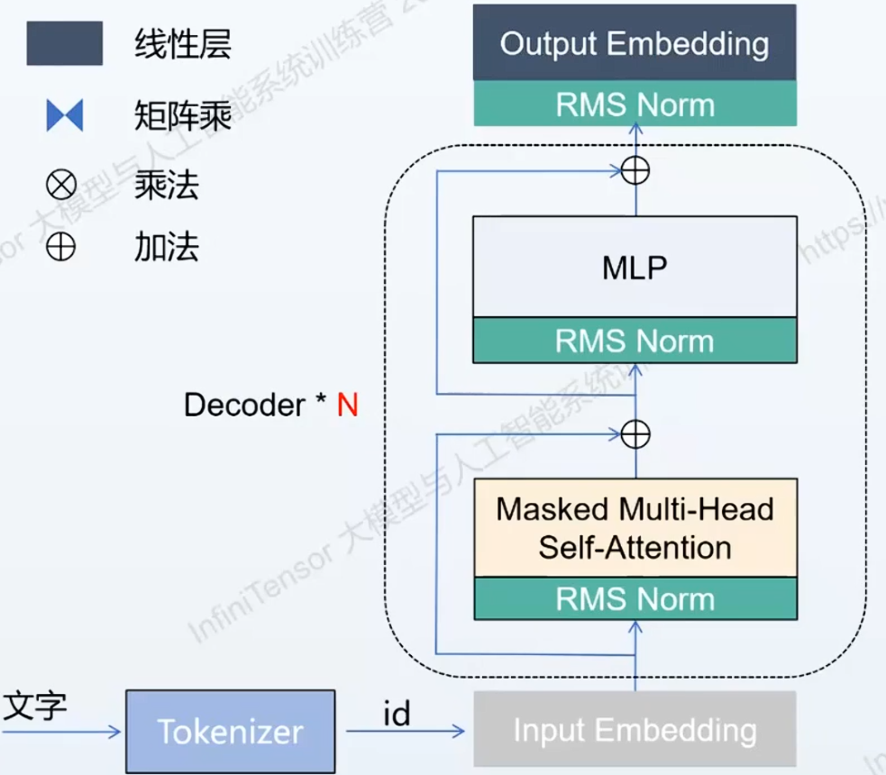
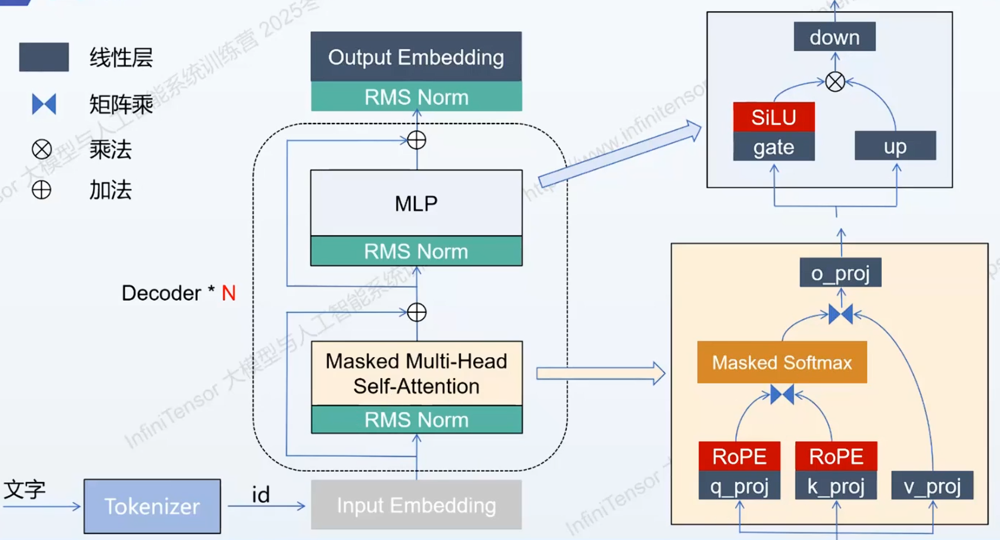
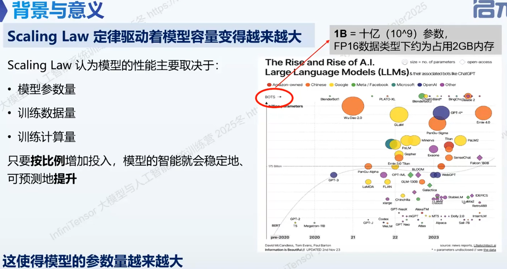
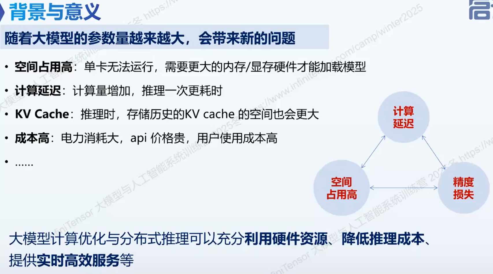
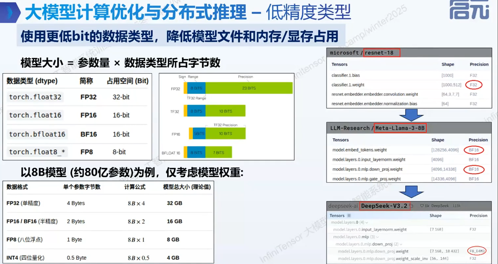

学前回顾

1️⃣ AI对话的生成过程

大模型文本生成是一个词语接龙的过程，我们输入一句话，经过大语言模型，他会输出一个概率分布，表示每个字发生的概率。然后在进行下一轮文本生成的过程中，会把上一轮的输出作为下一轮的输入，和之前的输入拼接起来，共同发给这一轮的大语言模型。循环进行，直到结束符是概率最高的那个，这样就结束了。

AI对话不但有用户输入的 *中国的首都是*？，还有其他信息：比如说一些符号、提示（例如：你是一个助助手），把这堆信息送给大预言模型，进行循环的生成。

2️⃣ 大语言模型的内部结构

输入的文本先经过Tokenizer，它会把文字转化成一个数字的id，这个id经过embedding层会被映射成向量。然后向量经过Transformer的Decoder层。每个层包含两个部分。一个是Attention，然后是MLP。这两个过程会循环进行处理，处理要执行N次（类似于深度网络把很多层堆到一起）。N层结束之后，进去embedding，输出一个概率分布，然后得到最终想要的字。

MLP层有三个权重，Attention层有四个权重：QKVO。Attention层经过Softmax还有注意力的积计算。整体的语言模型的过程和它所涉及的一些模块就是这些。

当我们获得了这些之后，在做一些应用的时候，可能会面临一些性能方面的问题。

本节课背景与意义：

Scaling Law定律驱动着模型容量变得越来越大。Scaling Law指的是一个模型的容量，包括模型参数量、训练数据量、训练计算量这三个部分。Scaling Law总结出来的统计规律是如果我们按比例的增加一些投入，投入指的是模型参数量、训练数据量、训练计算量，让模型变得更大（参数量更多、训练数据也更多、训练时间也变得更长），模型就会变得越来越智能，这是一个总结的规律。

这个规律推论出模型会变得越来越大，右图也显示了这一点。横坐标是年份、纵坐标是模型的参数量，纵坐标的单位是Billion，1B是十亿参数，现在的模型以B为单位去衡量参数量。2020年只有几B，到2023年变成了几百B，所以现在的模型的参数量确实是越来越大。

随着现在模型的参数量变得越来越大，带来了一些新的问题。例如空间占用高，这时机器单卡是无法运行的，需要更大的内存和显存硬件，才能把模型加载进来。第二个问题是计算延迟，计算量会变得很大，计算一个字的时间会变长。在推理时，历史的KV cache随着对话的次数增加，KV cache所需的空间变得越来越大，导致几句话之后显存就爆掉了。还有成本很高，需要有更高的硬件、内存之类的，会导致它的API价格很贵，用户使用起来成本会变高。

由于这些问题，虽然大模型能工作之后，我们还需要考虑它的计算优化与分布式推理，能够充分利用硬件资源、降低推理成本以及提供实时高效的服务

本节课内容：

1️⃣ 低精度类型

在使用模型权重的时候，使用更低bit的数据类型，会降低模型文件和内存/显存占用。刚才的模型大小指的是参数量，但如果是模型所占的空间，是参数量（即参数的个数）*  一个参数的数据类型所占的字节数。这才是模型在硬盘和内存上的大小。这个数据类型，如果是pytorch的话，常用的数据类型有torch.float32（FP32）、FP16、BF16、FP8等，这些不同的数据类型，占的位是不一样的。torch.float32是32bit，也就是4个字节。对于FP32来说，它是1个符号位、8个指数位、23个小数位。FP16是一个符号位，5个指数位，10个小数位。

以8B模型为例，即80亿参数，仅考虑权重大小，KV cache和其他的暂时不用考虑。举个例子，只是理论值。如果是32精度，8B模型占32G显存。同样的参数量，如果把数据类型降低为FP16，模型大小变为16G，即之前的一半。所以在模型参数量保持不变的情况下，使用更低的数据结构的话，可以得到更小的文件，还可以得到更小的显存占用。

看右图，刚开始的resnet（2015年左右），常用默认的是FP32类型。随着文本语言模型越来越大，前几年Llama使用BF16。最近一两年，由于训练等其他反面开始做得很好，所以模型权重开始往FP8数据类型进行存储。

低精度类型还可以做量化推理。量化推理是牺牲计算精度，去换取更快的计算速度和更小的内存占用。过程是将浮点数运算，通过一个算法，可以大概理解为“四舍五入”，去映射到低精度的整数集合。在推理时，由于浮点计算慢，我们不使用浮点计算，而是使用整数计算。根据量化过程，发生的时间可以分为两大类，一类是训练时的量化，指的是模型在训练过程中就已经考虑到权重的量化，在训练结束之后，得到一个文件，这个文件里边包含的权重就已经是量化后的权重了。第二个大类是训练后的量化，含义是：在训练结束之后，得到的可能是FP32或者是BF16的权重文件，这个权重文件需要再经过额外的量化算法（这里的量化算法是一个大类，可能包含很多算法），经过算法处理，就会得到量化的权重文件。我们之后再用的话，就不会再用训练出来的原始文件了，而是使用量化后的权重文件去做模型的推理。

看左下边的图，这是浮点运算，会把它映射到整数的运算，会把浮点数所在的区间和INT 8 所在区间有一个对应的关系。在进行转换过程中，不可避免地会有小数位丢失。

看右下的图，这个例子把0.34进行量化之后，变成64，在进行计算的时候，我们用右边的数计算。

量化的优点是权重文件会变得很小，权重文件加载到内存或显存中的话，占用的资源会偏低。而且由于权重比较小，去访问一次权重，方寸会变得比之前快，访存吞吐量会变高。而且INT8有专门的TensorCore核心加速处理，INT8的计算速度约为FP16的两倍。还可以降低部署成本，例如一些端侧的设备直接跑FP16的模型是跑不起来的，因为它的显存是不够的，使用量化之后的模型可能就可以跑起来了。缺点是：量化之后，由于是浮点数转化成整数，会有精度损失，使模型的性能变差。但是我们的目的是运行这个模型，有些精度损失也是可以接受的。

举个例子，比如左下时Qwen3的0.6B的模型。它的原始的模型文件大小是1.5GB，它的很多权重的精度使用的是BF16的数据格式。官网还给了一个量化的格式，GPTQ是一种量化算法，把BF16的数据类型量化到INT8的数据类型，量化之后的权重文件是763MB，大小只有之前的一半。量化了权重之后，很多就变成INT8了，显示I32是因为它是以I32方式存储的，就是会把4个INT8连续去存，把INT8做成I32去存，实际用的还是INT8类型。

2️⃣ 融合算子

融合算子指的是把多个算子合并成一个算子，在推理时一次性执行，好处是减少内存的访问和kernel的发射次数。每次调用kernel都会有开销，kernel之间有气泡之类的。

在推理过程中一些算子融合方面的工作比如可以把矩阵乘法进行融合。左图是Attention模块的图，会把输入x经过三个权重矩阵映射到QKV，然后再进行计算

3️⃣ 模型结构

4️⃣ 分布式