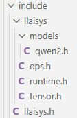

# include目录如下图所示：




# 在LLAISYS里，“层级”可以这样理解：

```mathematica
┌────────────────────────────┐
│ Python / Model / generate  │  ← 变化快、语义高
├────────────────────────────┤
│   Ops API（llaisys_ops.h） │
├────────────────────────────┤
│ Runtime C ABI（llaisys.h） │  ← 最底层【对外】
├────────────────────────────┤
│ C++ Tensor / Device / Kern │
├────────────────────────────┤
│ CUDA / CPU / Driver        │
└────────────────────────────┘
```

# llaisys.h

`llaisys.h` 是 **LLAISYS Runtime 的最底层 C ABI 接口定义文件**。

1. 这里的**最底层**指的是：所有对外API的地基，其他所有对外接口（`ops/tensor`）都依赖他，但它不依赖任何上层语义。一旦`llaisys.h`变化，位于它上层的所有东西都要重编、重绑定、重适配。

2. **ABI**（Application Binary Interface）：“编译后，二进制层面如何互相调用”。它规定了函数名长什么样、参数如何压栈/传寄存器、struct/enum在内存里的布局，谁负责释放内存。

3. 为什么是**C ABI**：因为C 是“事实上的跨语言最小公分母”，几乎所有的语言都能调用C ABI（例如`python、rust、java、C++`等）。而且C++ ABI 是不稳定的，体现在不同编译器不一样、不同版本不一样、name mangling不可控。所以对外接口必须使用C ABI。

4. **Runtime**在LLASYS中的定义是：负责把计算正确地、在正确设备上执行出来。

|      责任       |        举例        |
| :-------------: | :----------------: |
| Tensor 生命周期 | 分配 / 释放 / 引用 |
|   Device 管理   |     CPU / GPU      |
|   Kernel 调度   |   用哪个 kernel    |
|    内存拷贝     |     H2D / D2H      |
|    执行语义     |    同步 / 异步     |

​    Runtime不关心模型语义，只关心“如何跑”。

5. 为什么它是**接口定义文件**？

   因为它只做三件事：

   1️⃣  声明类型（enum / handle）

   2️⃣  生命调用规则（extern "C"）

   3️⃣  声明可见性（__export）

   它不包含任何实现，“我承诺你可以这样调用我，但我没告诉你我是怎么实现的。”

6. 为什么需要接口定义文件？

   如果没有接口定义文件，会发生什么？

   ❌1️⃣  ：直接暴露 C++ 类

   ```C++
   class Tensor {
     std::vector<int64_t> shape;
     ...
   };
   ```

   这样的话：Python调用不了，ABI不稳定，改一个成员，全部崩

   ❌ 2️⃣：头文件里全是实现

   这样的话：编译慢、耦合高、无法隐藏内部设计、无法替换实现

7. 为什么接口定义文件要放在这个头文件里？

   `llaisys.h` 的内容特点是：✅ 不依赖 C++、✅ 不依赖 Tensor 实现、✅ 不依赖算子语义、✅ 不依赖 STL、✅ 不依赖第三方库，它是 **“零负担可包含头文件”**

8. 代码

   ```C
   #ifndef __LLAISYS_H__//头文件保护
   #define __LLAISYS_H__
   
   //__export：跨平台“符号导出”宏
   #if defined(_WIN32)
   #define __export __declspec(dllexport)
   #elif defined(__GNUC__) && ((__GNUC__ >= 4) || (__GNUC__ == 3 && __GNUC_MINOR__ >= 3))
   #define __export __attribute__((visibility("default")))
   #else
   #define __export
   
   #endif//头文件保护，防止头文件被重复包含导致重复定义错误，这是所有公共头文件的标配
   #ifdef __cplusplus
   #define __C extern "C"//为什么需要 extern "C"？C++ 有 name mangling（名字改编），导致在C++编译后C或者python不认识编译后的新名字，所以extern "C" void foo(int);就会强制使用 C ABI。
   #include <cstddef>
   #include <cstdint>
   #else
   //__C：C / C++ ABI 兼容，让这个头文件既能被 C 编译器用，也能被 C++ 编译器用，__C 的真实含义是：“以下声明是 C ABI，不要做 C++ 名字改编”
   #define __C
   #include <stddef.h>
   #include <stdint.h>
   #endif
   
   // Device Types：设备抽象，这是一个运行时设备抽象层。
   typedef enum {
       LLAISYS_DEVICE_CPU = 0,
       LLAISYS_DEVICE_NVIDIA = 1,
       LLAISYS_DEVICE_TYPE_COUNT
   } llaisysDeviceType_t;
   
   // Data Types：统一的数据类型系统，Runtime 层的 dtype 系统
   typedef enum {
       LLAISYS_DTYPE_INVALID = 0,
       LLAISYS_DTYPE_BYTE = 1,
       LLAISYS_DTYPE_BOOL = 2,
       LLAISYS_DTYPE_I8 = 3,
       LLAISYS_DTYPE_I16 = 4,
       LLAISYS_DTYPE_I32 = 5,
       LLAISYS_DTYPE_I64 = 6,
       LLAISYS_DTYPE_U8 = 7,
       LLAISYS_DTYPE_U16 = 8,
       LLAISYS_DTYPE_U32 = 9,
       LLAISYS_DTYPE_U64 = 10,
       LLAISYS_DTYPE_F8 = 11,
       LLAISYS_DTYPE_F16 = 12,
       LLAISYS_DTYPE_F32 = 13,
       LLAISYS_DTYPE_F64 = 14,
       LLAISYS_DTYPE_C16 = 15,
       LLAISYS_DTYPE_C32 = 16,
       LLAISYS_DTYPE_C64 = 17,
       LLAISYS_DTYPE_C128 = 18,
       LLAISYS_DTYPE_BF16 = 19,
   } llaisysDataType_t;
   
   // Runtime Types：“不透明的运行时句柄”，外部用户不能也不应该知道内部结构，对外暴露为 void*
   typedef void *llaisysStream_t;
   
   // Memory Copy Directions：内存拷贝方向
   typedef enum {
       LLAISYS_MEMCPY_H2H = 0,
       LLAISYS_MEMCPY_H2D = 1,
       LLAISYS_MEMCPY_D2H = 2,
       LLAISYS_MEMCPY_D2D = 3,
   } llaisysMemcpyKind_t;
   
   #endif // __LLAISYS_H__
   ```

# ops.h

定义了 LLAISYS Runtime 对外暴露的“**算子级 C ABI 接口**”

1. 代码

   ```c
   #ifndef LLAISYS_OPS_H
   #define LLAISYS_OPS_H
   
   #include "tensor.h"//，引入唯一合法的计算对象：llaisysTensor_t，在LLAISYS中，一切算子的输入/输出必须是Tensor句柄。这是Runtime对控制权的声明：不允许裸传内存指针、不允许外部控制shape/stride/device，所有合法性检查必须在Runtime内完成。
   __C {//使用_C指明：以下声明是 C ABI，不要做 C++ 名字改编
       __export void llaisysAdd(llaisysTensor_t c, llaisysTensor_t a, llaisysTensor_t b);//本质是extern "C" __declspec(dllexport) void llaisysAdd(...);
       __export void llaisysArgmax(llaisysTensor_t max_idx, llaisysTensor_t max_val, llaisysTensor_t vals);
       __export void llaisysEmbedding(llaisysTensor_t out, llaisysTensor_t index, llaisysTensor_t weight);
       __export void llaisysLinear(llaisysTensor_t out, llaisysTensor_t in, llaisysTensor_t weight, llaisysTensor_t bias);
       __export void llaisysRearrange(llaisysTensor_t out, llaisysTensor_t in);
       __export void llaisysRmsNorm(llaisysTensor_t out, llaisysTensor_t in, llaisysTensor_t weight, float eps);
       __export void llaisysROPE(llaisysTensor_t out, llaisysTensor_t in, llaisysTensor_t pos_ids, float theta);
       __export void llaisysSelfAttention(llaisysTensor_t attn_val, llaisysTensor_t q, llaisysTensor_t k, llaisysTensor_t v, float scale);
       __export void llaisysSwiGLU(llaisysTensor_t out, llaisysTensor_t gate, llaisysTensor_t up);
   }
   
   #endif
   ```

2. 为什么要把这些函数**放在这里**？

   1️⃣ 为什么不放在 `llaisys.h` 里？

   `llaisys.h` 的职责是：定义“运行时的基础世界观”（设备是什么、dtype有哪些、stream是什么、memcpy语义是什么），它不应该知道任何模型语义，而`ops.h`这里的`Add / Attention / Linear` 明显是 **模型层概念**。所以必须拆出来。

   2️⃣ 为什么不放在 `tensor.h` 里？

   `tensor.h`通常只负责：Tensor 是什么、Tensor 怎么创建 / 销毁、Tensor 的元信息接口。Tensor 是“数据容器”，不是“计算语义”。把算子放进去会造成 **职责污染**。

   3️⃣ 为什么不用 C++ 接口（class / method）？

   如果写成`Tensor::add(const Tensor&);`那么，Python ctypes 不能用、ABI 不稳定、后续 device / kernel 演进成本极高，所以 Runtime 层 **必须用 C ABI**。

3. 它在整个项目中的地位

   1️⃣ 架构定位图

   ```mathematica
   ┌──────────────────────────────┐
   │ Python / generate / Model    │
   │ (模型逻辑，for 循环)           │
   ├──────────────────────────────┤
   │ llaisys_ops.h                │  ←【你现在问的】
   │ 算子级 C ABI（模型语义）        │
   ├──────────────────────────────┤
   │ llaisys.h                    │
   │ Runtime 基础 C ABI            │
   ├──────────────────────────────┤
   │ Tensor / Device / Stream     │
   │ (C++ 实现层)                  │
   ├──────────────────────────────┤
   │ Kernel / CUDA / CPU          │
   └──────────────────────────────┘
   
   ```

   2️⃣ 它是“模型与 Runtime 的分界线”

   可以理解成：“模型世界对 Runtime 的唯一合法入口”。因为模型代码不能直接操作Tensor内存、直接调用CUDA kernel、直接访问device细节。它只能：

   ```c
   llaisysLinear(...)
   llaisysSelfAttention(...)
   ```

   3️⃣ 它是“稳定 API 层”，不是实验区

   如果这个文件变化，则python绑定要改、文档要改、所有模型代码要改。所以它的设计一定是少而稳。所以它是接口定义文件，而不是实现文件。这正好符合Runtime的设计原则：“接口稳定，内部实现可以随意推翻重写”

# runtime.h

这是**“Runtime 能力本身的抽象入口”**，它定义了 LLAISYS Runtime 的“函数表（function table）接口”，用于在运行时按设备类型（CPU / NVIDIA）获取一整套底层执行能力。

1. 代码

   ```C
   #ifndef LLAISYS_RUNTIME_H
   #define LLAISYS_RUNTIME_H
   
   #include "../llaisys.h"
   
   __C {
       // Runtime API Functions，1️⃣ 它引入了 Runtime 级别的“能力接口”，而不是函数实现，不是__export void llaisysMallocDevice(...);而是typedef void *(*malloc_device_api)(size_t);也就是说：Runtime 的能力不是通过“全局函数”暴露的，而是通过“函数指针表”暴露的。
       
   //2️⃣ 它把 Runtime 能力分成了4类，这四类正好构成一个最小可用Runtime。
       // 🔹Device管理：控制“当前执行设备上下文”
       typedef int (*get_device_count_api)();
       typedef void (*set_device_api)(int);
       typedef void (*device_synchronize_api)();
       // 🔹Stream管理：控制“异步执行语义”
       typedef llaisysStream_t (*create_stream_api)();
       typedef void (*destroy_stream_api)(llaisysStream_t);
       typedef void (*stream_synchronize_api)(llaisysStream_t);
       // 🔹Memory内存管理：Runtime 自己掌控内存，而不是交给外部
       typedef void *(*malloc_device_api)(size_t);
       typedef void (*free_device_api)(void *);
       typedef void *(*malloc_host_api)(size_t);
       typedef void (*free_host_api)(void *);
       // 🔹Memory copy内存拷贝：统一 CPU / GPU / Stream 的拷贝语义
       typedef void (*memcpy_sync_api)(void *, const void *, size_t, llaisysMemcpyKind_t);
       typedef void (*memcpy_async_api)(void *, const void *, size_t, llaisysMemcpyKind_t, llaisysStream_t);
       
   //3️⃣ struct LlaisysRuntimeAPI = Runtime 的“能力表”，这在架构上等价于：CUDA 的 cudaDriverGetProcAddress、Vulkan 的 VkDeviceDispatchTable、ONNX Runtime 的 OrtApi。它的语义是：“你拿到这张表，就等于拿到了 Runtime 的全部底层能力。”
       struct LlaisysRuntimeAPI {
           get_device_count_api get_device_count;
           set_device_api set_device;
           device_synchronize_api device_synchronize;
           create_stream_api create_stream;
           destroy_stream_api destroy_stream;
           stream_synchronize_api stream_synchronize;
           malloc_device_api malloc_device;
           free_device_api free_device;
           malloc_host_api malloc_host;
           free_host_api free_host;
           memcpy_sync_api memcpy_sync;
           memcpy_async_api memcpy_async;
       };
   
       //4️⃣ Llaisys API for getting the runtime APIs，这是关键入口函数。它的语义是：“给我一个设备类型，我返回一套对应设备的 Runtime 能力实现。” 例如：LLAISYS_DEVICE_CPU → CPU Runtime、LLAISYS_DEVICE_NVIDIA → CUDA Runtime
       __export const LlaisysRuntimeAPI *llaisysGetRuntimeAPI(llaisysDeviceType_t);
   
       //5️⃣ Llaisys API for switching device context，这是上下文切换接口。它的作用是：选择当前 Runtime、选择当前 device id、影响后续所有 Tensor / Kernel / memcpy 行为。这是 Runtime 的全局上下文入口。
       __export void llaisysSetContextRuntime(llaisysDeviceType_t, int);
   }
   
   #endif // LLAISYS_RUNTIME_H
   
   ```

2. 为什么要放在这里？

   1️⃣ 它比 `llaisys_ops.h` 更“底层”

    Runtime API **不涉及模型语义**，只涉及“执行能力”。

   2️⃣ 它是“后端插件接口”，不是模型接口

   Runtime API 是给“设备后端实现者”用的，不是给模型写作者用的。

   例如，写CPU backend、写 CUDA backend、将来写 Ascend backend，他们要实现的就是这张函数表。

   3️⃣ 它天然支持“多后端 + 动态切换”

   如果你把这些写成：`void llaisysMallocDevice(...);`就只能有一个实现

   而现在：`const LlaisysRuntimeAPI *api = llaisysGetRuntimeAPI(device);`你可以：CPU 一套实现、GPU 一套实现、同一进程里切换，这是插件化 Runtime 的基础。

3. 它在整个项目中的“地位”

   `llaisys_runtime.h` 是 Runtime 后端与前端逻辑之间的“执行能力契约”，是整个系统能否支持多设备、多后端的关键抽象层。

4. 为什么要用“函数指针表”而不是直接函数？

   原因只有一个，但极其重要：ABI稳定+插件化+多实现。优势包括：后端可独立编译、不需要链接所有后端、易于扩展新设备、避免全局符号冲突。

5. “函数指针表”本质是什么呢？

   ```C
   struct LlaisysRuntimeAPI {
       get_device_count_api get_device_count;
       set_device_api set_device;
       device_synchronize_api device_synchronize;
       create_stream_api create_stream;
       destroy_stream_api destroy_stream;
       stream_synchronize_api stream_synchronize;
       malloc_device_api malloc_device;
       free_device_api free_device;
       malloc_host_api malloc_host;
       free_host_api free_host;
       memcpy_sync_api memcpy_sync;
       memcpy_async_api memcpy_async;
   };
   ```

   这是一个 **“设备运行时虚函数表（vtable）**， 用来屏蔽 CPU / CUDA / Ascend / OpenCL 等不同设备运行时差异。它和 C++ 的虚函数表 **语义等价**，只是用 **C 风格函数指针** 实现。

6. “函数指针表”是怎么链接/切换设备的？

   1️⃣ 核心机制：**每种设备 = 一张函数指针表**

   工程里**一定存在**下面这种结构（不在头文件里，而在 `.cpp`）：

   ```C
   // cpu_runtime.cpp
   static LlaisysRuntimeAPI cpu_runtime_api = {
       .get_device_count = cpuGetDeviceCount,
       .set_device = cpuSetDevice,
       .device_synchronize = cpuDeviceSynchronize,
       .create_stream = cpuCreateStream,
       ...
   };
   ```

   ```C
   // cuda_runtime.cpp
   static LlaisysRuntimeAPI cuda_runtime_api = {
       .get_device_count = cudaGetDeviceCount,
       .set_device = cudaSetDevice,
       .device_synchronize = cudaDeviceSynchronize,
       .create_stream = cudaCreateStream,
       ...
   };
   ```

   ```C
   // ascend_runtime.cpp
   static LlaisysRuntimeAPI ascend_runtime_api = {
       .get_device_count = ascendGetDeviceCount,
       .set_device = ascendSetDevice,
       ...
   };
   ```

   每个 `.cpp` 文件，定义 **一整张 `LlaisysRuntimeAPI` 表**，表里的函数 **全部是该设备的真实实现**。

   2️⃣ 设备切换的“总入口”

   `Runtime.h`头文件里的这个函数：

   ```C
   __export const LlaisysRuntimeAPI *llaisysGetRuntimeAPI(llaisysDeviceType_t);
   ```

   它是**整个切换机制的“中枢”**。典型实现：

   ```C
   // runtime_dispatch.cpp
   const LlaisysRuntimeAPI *
   llaisysGetRuntimeAPI(llaisysDeviceType_t device) {
       switch (device) {
       case LLAISYS_DEVICE_CPU:
           return &cpu_runtime_api;
       case LLAISYS_DEVICE_CUDA:
           return &cuda_runtime_api;
       case LLAISYS_DEVICE_ASCEND:
           return &ascend_runtime_api;
       default:
           return nullptr;
       }
   }
   ```

   输入：设备类型 enum，输出：该设备对应的一整套运行时函数

   3️⃣ 全局“当前运行时”的保存（真正的切换）

   再看这个 API：

   ```C
   __export void llaisysSetContextRuntime(llaisysDeviceType_t, int);
   ```

   它通常做的事是：

   ```c
   static const LlaisysRuntimeAPI *current_runtime = nullptr;
   static int current_device_id = 0;
   
   void llaisysSetContextRuntime(llaisysDeviceType_t type, int device_id) {
       current_runtime = llaisysGetRuntimeAPI(type);
       current_runtime->set_device(device_id);
       current_device_id = device_id;
   }
   ```

   `current_runtime` 指向哪张表,整个系统之后用的就是哪种设备

7. 这些函数是“在哪里被调用”的？

   你不会在算子里直接看到 `cudaMalloc` 或 `aclrtMalloc`，而是看到：

   ```C
   current_runtime->malloc_device(size);
   current_runtime->memcpy_async(dst, src, size, kind, stream);
   ```

   举个完整调用链例子:

   ① 用户代码

   ```c++
   Tensor t(shape, DTYPE_F16, LLAISYS_DEVICE_CUDA);
   ```

   ② Tensor 构造函数里

   ```
   auto rt = llaisysGetRuntimeAPI(device_type);
   data = rt->malloc_device(bytes);
   ```

   ③ 实际执行的是

   CPU → `malloc` 、CUDA → `cudaMalloc`、Ascend → `aclrtMalloc`。Tensor 完全不知道它跑在哪个设备上。

8. 为什么一定要放在 `runtime` 层？

   如果不这么做，会怎样？❌ 算子里写：

   ```c++
   #ifdef USE_CUDA
   cudaMalloc(...)
   #elif USE_ASCEND
   aclrtMalloc(...)
   #endif
   ```

   后果是：算子代码不可维护、新设备要改全工程、根本不可能教学 / 扩展。

# tensor.h

它定义了 LLAISYS 中唯一的**基础数据对象**：Tensor，并提供一个稳定的**C API**接口来操纵它。

1. 代码

   ```c
   #ifndef LLAISYS_TENSOR_H
   #define LLAISYS_TENSOR_H
   
   #include "../llaisys.h"
   
   __C {
       typedef struct LlaisysTensor *llaisysTensor_t;//1️⃣为什么 Tensor 用「不透明指针」？struct LlaisysTensor的真实定义在.cpp，头文件里 完全隐藏内部布局，外部只能通过API操作。好处：ABI稳定：可以跨语言（Python / ctypes / Rust）、封装：不允许用户直接改 shape / data 指针、可扩展：内部可加 refcount / stream / layout。
       
   //2️⃣创建 / 销毁：它们负责：保存 shape / stride / dtype、分配 设备或主机内存、绑定 device_type + device_id、初始化 runtime API 指针。
       __export llaisysTensor_t tensorCreate(
           size_t * shape,
           size_t ndim,
           llaisysDataType_t dtype,
           llaisysDeviceType_t device_type,
           int device_id);
   
       __export void tensorDestroy(
           llaisysTensor_t tensor);
       
   //3️⃣Tensor 的“只读元信息接口”：这些函数不涉及计算，只读状态。为什么这些不能直接暴露结构体字段？stride 可能是 view / permute 后算出来的，contiguous 不是 static 属性，device 可能后续支持迁移。📌 Tensor 是逻辑对象，不是裸内存块。
       __export void *tensorGetData(
           llaisysTensor_t tensor);//tensorGetData 的真实地位：这不是“随便给你指针”。它的语义是：返回 该 Tensor 当前 device 上的底层数据指针。设备是CPU的话，返回malloc的host pointer，CUDA的话，返回void* device pointer，Ascend返回aclrtMalloc pointer。📌 这是危险但必要的：ops 层要把这个指针喂给 kernel、Python 绑定要访问数据
   
       __export size_t tensorGetNdim(
           llaisysTensor_t tensor);
   
       __export void tensorGetShape(
           llaisysTensor_t tensor,
           size_t * shape);
   
       __export void tensorGetStrides(
           llaisysTensor_t tensor,
           ptrdiff_t * strides);
   
       __export llaisysDataType_t tensorGetDataType(
           llaisysTensor_t tensor);
   
       __export llaisysDeviceType_t tensorGetDeviceType(
           llaisysTensor_t tensor);
   
       __export int tensorGetDeviceId(
           llaisysTensor_t tensor);
   
       __export uint8_t tensorIsContiguous(
           llaisysTensor_t tensor);
       
   //5️⃣tensorDebug 的真实作用，通常用于打印 shape / stride / dtype / device、检查 contiguous、教学调试
       __export void tensorDebug(
           llaisysTensor_t tensor);
       
       
   //5️⃣tensorLoad：第一个“跨设备语义”，📌 这是：host → device 数据入口
       __export void tensorLoad(
           llaisysTensor_t tensor,
           const void *data);
   //他一般做的是：
   //if (tensor->device == CPU)
   //    memcpy(...)
   //else
   //    runtime->memcpy_sync(tensor->data, data, bytes, HOST_TO_DEVICE);
   
       
   //4️⃣Tensor 的“形状与视图语义”（核心设计）
       __export llaisysTensor_t tensorView(
           llaisysTensor_t tensor,
           size_t * shape,
           size_t ndim);//语义：共享底层数据，只改变 shape / stride。不分配新内存、类似 PyTorch view、要求 contiguous（或能推导 stride）
   
       __export llaisysTensor_t tensorPermute(
           llaisysTensor_t tensor,
           size_t * order);//语义：只换维度顺序，不搬数据。stride 重新计算、contiguous 可能变 false。
   
       __export llaisysTensor_t tensorSlice(
           llaisysTensor_t tensor,
           size_t dim,
           size_t start,
           size_t end);//语义：子 Tensor 视图。
   }
   
   #endif // LLAISYS_TENSOR_H
   ```

2. 它在整个项目中的“地位”？

   Tensor 是 LLAISYS 中唯一被所有层共同依赖的对象：

   ”ops 通过 Tensor 取 data“

   ”runtime 为 Tensor 分配内存“

   ”model 通过 Tensor 组织计算“

   ”Python binding 直接操纵 Tensor“

   