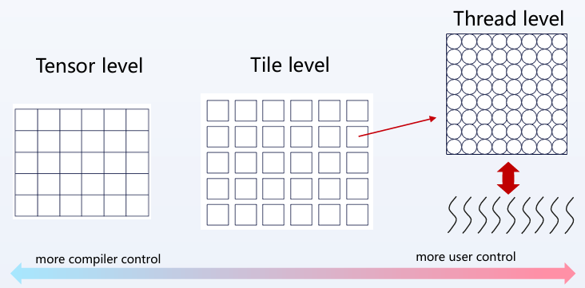
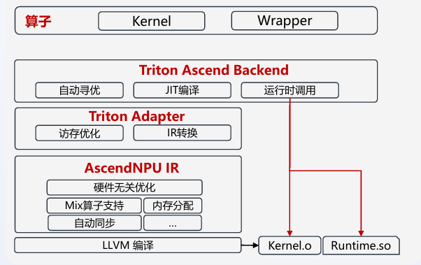

[TOC]


# 全流程掌握面向昇腾的Triton算子开发


## 1.Triton-Ascend架构

​    对于**对硬件了解不深，但是对开发的速率和效率需求很高**的人，适合使用效率高但极致调优性能没有那么高的**Triton**来开发。但是如果对**有深度优化性能需求**的场景，例如需要对一些重点算子进行**关键性能的突破**，就需要用各个硬件的native C，比如昇腾的**Ascend C**来开发。两种编程方式是**可以配合**的：可以先通过Triton来实现**整体模型算子开发**或者是实现创新算法，来享受到开发效率的红利。然后去识别**热点算子/性能表现不好的算子**，再使用另一种方式来压榨算子的性能。

------

​    从数据视角看，Triton 是一种 Tile-level（分块级）编程模型。**它位于 **Tensor-level（张量级）** 与 **Thread-level（线程级）** 之间，通过高层 API 抽象隐藏硬件细节，把大量底层工作交给编译器（MLIR / LLVM / 后端）， 而开发者主要负责 **数据分块（tiling）与核间调度策略**。



1️⃣ Tensor level（最左边）

​    ① 含义：把数据当作**整体张量**，不显式关心：分块、线程、寄存器 / shared memory、内存访存模式。

​    ② 典型代表：PyTorch / TensorFlow，算子级 IR（如 ONNX、Relay 高层）

​    ③ 特点：编译器控制最多，开发者几乎不能控制执行细节。

2️⃣ Tile level（中间，Triton 所在的位置）

​    ① Tile含义：把一个大张量 **切成规则的小块（tile / block）**，每个 tile 作为一个**独立的并行任务**。

​    ② Triton 在这里做了什么？

​        ❶ 用户显式指定：tile 的 shape、tile 如何映射到 program_id、数据分块策略。

​        ❷ 编译器自动完成：tile 内的线程映射、向量化（SIMD）、内存合并（coalescing）、shared memory / local memory 管理、pipeline / latency hiding。

3️⃣ Thread level（最右边）

​    ① 含义：显式操纵线程 / warp / wavefront，手写同步、访存、bank conflict。

​    ② 典型代表：CUDA C / HIP、OpenCL、汇编级 kernel。

​    ③ 特点：用户控制最多，开发成本高、可移植性差

------


​    Triton 本质上是一种面向 GPU 的编程语言，其原生编译路径围绕 GPU 的执行模型设计。前端 Triton DSL 首先被降低为 Triton IR（基于 MLIR），随后进一步降低到 TritonGPU IR，在该层完成面向 GPU 的通用优化。之后，IR 会继续向下转换为特定厂商的 GPU IR（如 NVGPU IR 或 AMDGPU IR），并最终通过 LLVM / NVVM 等后端编译生成对应硬件的二进制代码。

​    然而，Ascend 采用的是 NPU 架构，其执行模型与 GPU 存在本质差异，因而并不适合直接复用 TritonGPU IR。针对这一差异，Ascend 后端选择在 Triton IR 之后直接引入 Linalg IR 作为中间表示，以保持张量与算子级语义的完整性。随后，IR 被进一步降低到 AscendNPU IR，该 IR 包含高、低两个层级的方言：高层方言用于对接前端 DSL 与算子表达，低层方言用于精确描述硬件控制能力。在 AscendNPU IR 层完成面向硬件的自动调优后，最终通过毕昇编译器的 LLVM 后端生成昇腾处理器的二进制代码。

------



1️⃣ 开发接口主线（最上层）

```sql
算子 → Kernel → Wrapper
```

​    对用户而言，编程范式仍然是 **社区 Triton**，不需要感知 Ascend NPU 的硬件细节，Triton-Ascend **完整兼容社区 Triton 的 DSL 与开发模式**。

2️⃣ 编译与优化主线（系统核心）① ② ③ ④ ⑤

​    ① Triton Ascend Backend：控制与调度层

​    核心职责是自动调优、JIT编译、运行时调度与调用。本质作用是承接社区 Triton 的“执行与调度语义”，并对接 Ascend 后端。

​    ② Triton Adapter：语义转换与访存优化层

​    在编译过程中，Triton Adapter 作为关键适配层，负责将面向 GPU 执行模型的 Triton IR 转换为更适合 SIMD/NPU 架构的 Linalg IR。昇腾是 **SIMD 架构**，对 **连续、规则访存**极其敏感。Triton 中可能存在离散访存或GPU 风格的访存假设，因此在 Triton Adapter 中做 **访存模式重写与优化**和 **IR lowering：Triton IR → Linalg IR**。

​    ③ AscendNPU IR：硬件语义落地层

​    随后，IR 被进一步降低至 AscendNPU IR。该 IR 分为高、低两个层级：高层 IR 侧重于硬件无关的通用优化，而低层 IR 则精确刻画昇腾 NPU 的硬件控制能力，支持 Mix 算子融合、内存自动分配与自动同步等优化策略，从而将原本需要开发者在 Ascend C 层手工完成的性能调优工作转移至毕昇编译器中自动完成。

3️⃣ 运行时与产物主线（最下层）

​    最终，经 LLVM 后端编译生成 Kernel.o，并由 Triton-Ascend Runtime 进行统一调度与执行。

------

## 2.Triton-Ascend的开发环境

1️⃣ 下载CANN（昇腾上的基础的软件栈），提供了编程语言、高封装的算子库、毕昇编译器、Runtime driver。在https://hiascend.com/cann首页可以下载，还有开源代码仓，以及CANN的文档。Triton-Ascend要求CANN版本 $\ge 8.3$ 。在版本选择中选择版本和CPU架构，就可以获得软件包。在开发包里，我们需要Toolkit和kernels。按照文档安装即可。

2️⃣安装Triton-Ascend。https://gitcode.com/Ascend/triton-ascend/。第一步安装依赖的包，requirement文件列出了所有需要安装的软件包。安装好依赖以后，就可以完成部署和运行。

## 3.Triton算子的开发范式


## 4.面向昇腾算子开发


## 5.性能优化


## 6.高性能样例：Matmul


