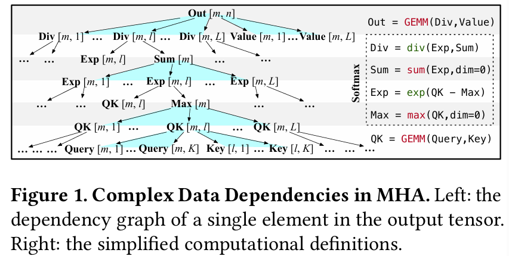
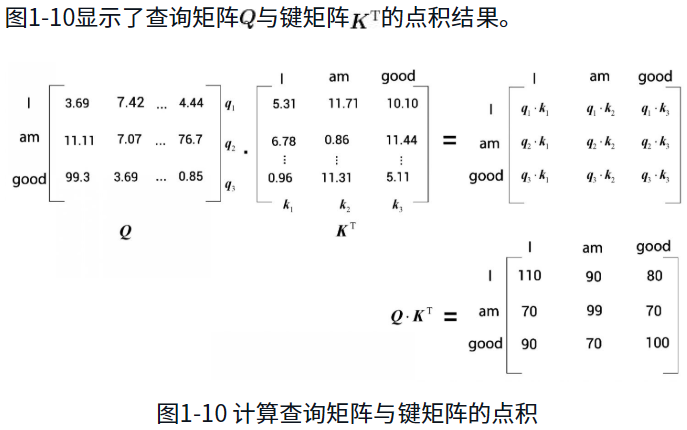
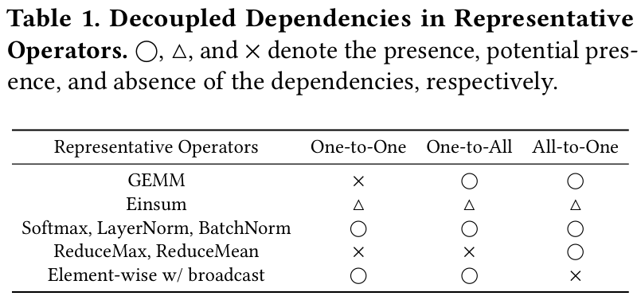
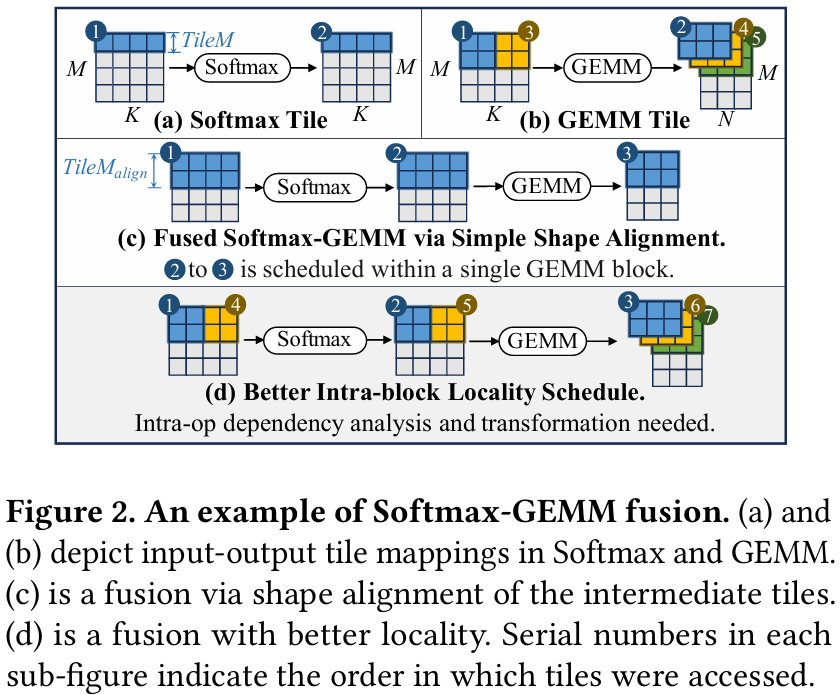

SpaceFusion：基于空间映射图的高级深度学习算子融合方法

摘要：本文提出了 SpaceFusion，一种用于高效深度学习算子融合的==高级调度器==。首先，我们提出了一种新的抽象——**空间映射图**（Space-Mapping Graph，SMG），用于**整体性地建模算子间与算子内部依赖关系的空间信息**。随后，我们引入了**空间切分器**和**时间切分器**，对 SMG 中定义的融合计算空间进行分解，并通过对依赖关系的分析与变换生成融合调度方案。最后，我们提出了一套**自动调度方法**，利用上述切分器，根据具体的硬件资源配置，**自动生成高性能的算子融合调度**。端到端性能评估结果表明，在 Transformer 模型上，SpaceFusion 相较于 HuggingFace 提供的基线实现，**最高可获得 8.79× 的加速（平均加速比为 3.54×）**；同时，相比当前最先进的、基于 FlashAttention 的手工优化实现，**最高可实现 2.21× 的性能提升**。

1 引言

**由深度学习模型所定义的张量计算呈现出两个显著趋势：计算规模的持续增长以及计算复杂度的不断提升** [27, 28, 37, 40, 51, 52]。这使得无论是在云端基础设施还是在本地设备上，将其部署为**高效、低时延的推理服务**都变得更加昂贵且更具挑战性 [43, 44]。计算规模的增长意味着需要为更大的模型权重、输入数据、输出数据以及中间数据分配更多的内存资源，从而导致更高的内存 I/O 开销和更大的内存占用。与此同时，**计算复杂度的提升主要源于非逐元素算子的增多**，例如广义矩阵乘（Generalized Matrix Multiplication，GEMM）和 Softmax [5]，这不仅增加了计算周期数量，还引入了更加复杂的数据依赖关系。**算子融合技术**（亦称为内核融合或层融合）通过将中间计算结果缓存在**更接近计算单元的存储介质**中以实现片上复用，从而缓解由计算规模扩大所带来的问题。这种方式能够在降低内存访问成本的同时，为推理服务提供更快的响应。然而，**在融合非逐元素算子方面，算子融合仍然面临显著挑战** [43, 70]。

**其中一个主要原因在于无块间依赖的并行性与块内数据局部性之间的权衡关系** [61]。在具有分层内存结构的典型 GPU 架构中 [41]，不同线程块之间只能通过**全局内存**进行数据交换（片外、访问速度较慢、容量较大，且对所有线程块可见）。若算子融合希望将中间计算结果缓存于**共享内存**中（片上、访问速度快、容量有限，且仅在单个线程块内可见），则在 GPU 架构下用于并行执行的线程块之间**必须不存在数据依赖关系** [26]。以**多头注意力（Multi-Head Attention，MHA）** 为例，其包含三个非逐元素算子，即两个 GEMM 和一个 Softmax。图 1 展示了输出张量中单个元素对其他张量元素的依赖关系。该复杂的依赖模式具有以下特征：（1）`元素之间存在层层嵌套的深度依赖关系`；（2）`依赖范围在某一张量维度上覆盖了整个维度区间`。==因此，在朴素地遵循这种宽范围且深度嵌套的依赖模式对 MHA 进行融合并映射到线程块时，往往会导致**块内数据局部性较差**，进而引发线程块内执行效率低下，甚至导致融合失败。==

现有的算子融合方法大体可分为两类：手工调优融合与自动调优融合。其中，**手工调优融合** [11, 22, 30, 31, 65] 是融合非逐元素算子的主流方案。这类方法通常面向**特定的张量计算模式**，由领域专家精心设计特定的数据流与并行策略，以实现对复杂依赖关系的算子融合。然而，手工调优融合存在两个关键局限性：**通用性受限**以及**开发成本高昂**。

自动调优融合因其良好的通用性和成本效益，提供了一种颇具前景的替代方案。然而，将非逐元素算子进行融合仍然超出了大多数现有深度学习（DL）框架与编译系统的能力范围 [4, 6, 29, 34, 43, 57, 66, 67]。其中，大多数方法 [6, 29, 34, 43, 67] 依赖于**高层抽象**，即基于计算图的数据流图（Dataflow Graph，DFG），主要面向逐元素算子的融合。这类抽象**无法刻画算子内部的依赖关系**，因此难以处理由复杂算子所定义的复杂数据依赖。另一类方法 [4, 57, 66] 采用诸如==**多面体模型**==等低层抽象，但由于其抽象粒度过细，所定义的搜索空间极其庞大，因而在高效识别最优算子融合方案方面同样存在局限。近期的一些研究工作 [49, 68, 70] 在更广泛算子类型的融合方面取得了突破，但仍未能完全解决相关问题。AStitch [70] 采用**基于规则的方法**对**内存密集型（Memory-Intensive，MI）算子**进行融合；Chimera [68] 提出了一种**纯分析驱动的方法**以融合**计算密集型（Compute-Intensive，CI）算子**。然而，这两种方法均==未能同时处理 MI 与 CI 算子的融合问题==。Welder [49] 利用 **tile-graph 抽象**，在内存层级内对算子间中间张量进行更细粒度（tile 级别）的调度。然而，其**无法抽象算子内部依赖关系**的局限性，限制了其构建**整体优化空间**的能力。

本文提出了 SpaceFusion，一种用于高效算子融合的高级调度器。其核心设计是一种称为**空间映射图**（Space-Mapping Graph，SMG）的空间级抽象（第 4.1 节）。尽管 SMG 是一种==轻量级的基于图的抽象方式==，但它能够有效刻画多个算子中存在的复杂依赖关系，从而支持构建一个**整体性的优化空间**。在此基础上，我们提出了==两种用于调度 SMG 的切分方法==。**空间切分器**（第 4.2 节）将一个 SMG 切分为多个可并行执行的 SMG 块，各块之间彼此独立；**时间切分器**（第 4.3 节）则将单个 SMG 块进一步切分为==多个串行执行的块内子单元，以降低片上内存占用，并挖掘潜在的优化机会==。最后，我们为 SMG 设计了==一套**自动调度方法**（第 5 节）==。其中，**资源感知切分方法**（第 5.1 节）结合空间切分器与时间切分器，在满足硬件资源约束的前提下，==自动生成算子融合调度方案==；**SMG 划分方法**（第 5.2 节）则==针对因硬件资源限制而无法直接调度的 SMG==，将其划分为更小的 SMG，并重新提交给切分流程处理。我们在由此生成的搜索空间中确定最优调度方案。实验评估结果表明，**SpaceFusion 能够在复杂依赖关系中挖掘隐藏的融合机会，并在多种 GPU 架构上实现显著的性能提升**。在==子图级性能评估==中，SpaceFusion 相较于==手工调优的未融合基线实现==，**最高可获得 10.35× 的加速（平均加速比为 5.31×）**；相较于==手工调优的融合库==，实现了**最高 4.03× 的加速**。在端到端性能评估中，对于 Transformer 模型，SpaceFusion 相较于 HuggingFace [62] 提供的基线实现，**最高可获得 8.79× 的加速（平均为 3.54×）**；同时，相比基于 FlashAttention [22] 的当前最先进（SOTA）手工优化实现 [31]，**最高可实现 2.21× 的性能提升**。

2 背景与前置知识

本节讨论了深度学习（DL）模型中**张量计算算子**的背景与预备知识。此外，我们深入探讨了由**单个算子**与**多个算子**定义的**张量计算**中所涉及的**复杂依赖模式**。

**张量计算算子**涵盖了**逐元素算子**与**非逐元素算子**。**逐元素算子**以直截了当的**依赖模式**为特征，能够简单地与其他算子完成**算子融合**，例如通过**原位内联**（in-place inlining）[6]实现。而**非逐元素算子**（例如 GEMM、Softmax、ReduceMean 以及带**广播的逐元素算子**）则是**复杂依赖关系**的主要来源[43]。

**单个算子内部依赖**。大多数**非逐元素算子**中的**依赖关系**可以被进一步细化。例如在 GEMM 中，给定矩阵乘法 $C_{M \times N} = A_{M \times K} B_{N \times K}$，输出张量的单个元素定义为：$$c_{mn} = \sum_{k=1}^{K} a_{mk} b_{nk}$$，其中 $a, b, c$ 分别是张量 $A, B, C$ 中的元素。对于每个 $n \in [1, N]$，单个元素 $a_{mk}$ 会被使用 $N$ 次，用于计算**中间元素** $a_{mk}b_{1k}, a_{mk}b_{2k}, \dots, a_{mk}b_{Nk}$，这意味着在整个 $N$ 范围内，一个**输入元素** $a_{mk}$ 被 $N$ 个**中间元素**所需求。我们将这种**依赖模式**标识为 **One-to-All**（一对多）。对于每个 $m \in [1, M]$，$b_{nk}$ 与**中间元素**之间也存在类似的 **One-to-All** 依赖。随后，通过在整个 $K$ 范围内对 $K$ 个**中间元素** $a_{m1}b_{n1}, a_{m2}b_{n2}, \dots, a_{mK}b_{nK}$ 求和，计算出输出元素 $c_{mn}$。我们将此模式标识为 **All-to-One**（多对一）。因此，GEMM 中的**依赖关系**可以进一步解耦为 **One-to-All** 与 **All-to-One** 依赖。表 1 展示了代表性的**非逐元素算子**中可能存在的解耦后的**依赖关系**，其中 **One-to-One**（一对一）表示**逐元素依赖**。

**表 1. 代表性算子中的解耦依赖**。$\square$、$\triangle$ 和 $\times$ 分别表示存在、潜在存在和不存在该依赖。

**多个算子中的复杂依赖**。多个算子间的依赖关系更为复杂，因为每个算子中出现的复杂依赖==相互**嵌套与组合**==，往往形成一个**宽且深**的**依赖树**，如图 1 所示。以图 1 右侧所示的 **MHA**（多头注意力机制）简化计算定义为例，输出张量的单个元素直接或间接地依赖于来自 ==8 个张量的 $(2LK + 4K + 2)$ 个元素==，具有 6 层**嵌套依赖**，包含==6 个 **One-to-All** 和 4 个 **All-to-One**==依赖，其中 $L$ 和 $K$ 分别表示序列长度和特征维度。

这种**复杂依赖模式**表现出以下特征：（1）元素之间层层深入的**深度嵌套依赖**；（2）覆盖整个张量维度范围的**宽依赖范围**。

3 主要挑战

我们认为，在为上述具有**复杂依赖关系**的**算子融合**生成高效**算子融合调度**时，存在两大挑战。表 2 对比了**算子融合**领域具有代表性的工作，展示了处理融合问题的==方法论差异==，并全面阐述了所面临的挑战。

**表 2. 代表性算子融合研究的对比分析**。表中列出了==用于融合的**抽象能力**（感知**算子间与算子内部依赖**）==以及==**算子融合调度**能力（访存变换、**依赖变换**、**存储层级调度**和**硬件资源感知**）==。

**图 2. Softmax-GEMM 融合示例**。(a) 和 (b) 描绘了 Softmax 和 GEMM 中的输入-输出 **tile** 映射。(c) 是通过**中间 tile** 的形状对齐（shape alignment）实现的融合。(d) 是具有更好**局部性**的融合。每个子图中的序列号表示 **tile** 的访问顺序。

